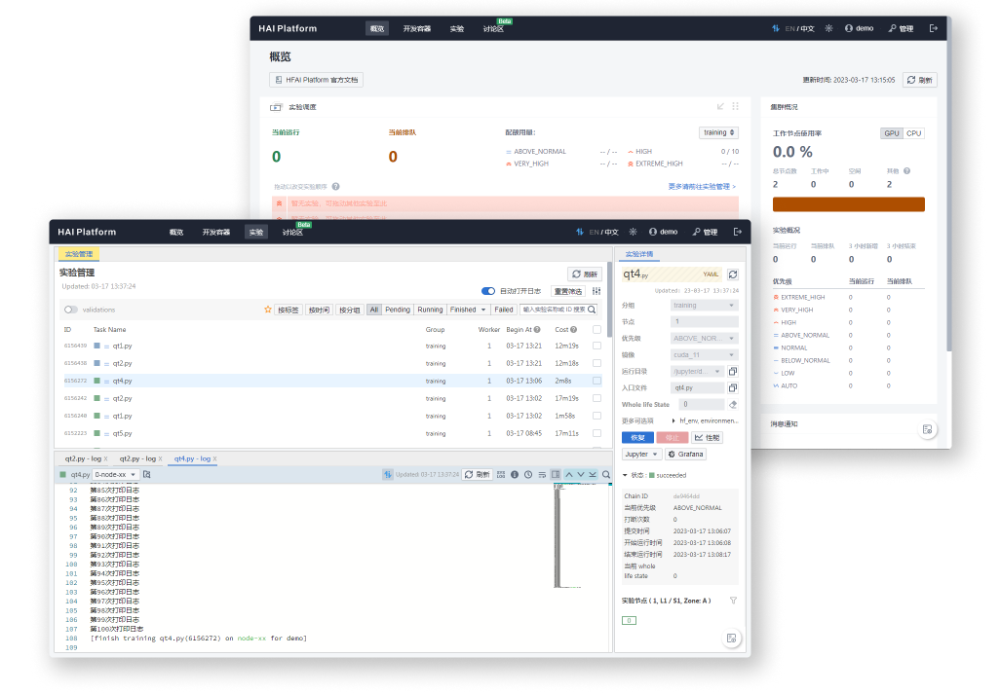

 

  

  

    配合 HAI Platform 使用的集成化用户界面
     
    <a href="#intro">介绍</a>
    ·
    <a href="#deployment">调试与部署</a>
    ·
    <a href="#supply">更多支持</a>
  

   

<!-- ABOUT THE PROJECT -->

## 介绍

HAI Platform Studio 是为 [HAI Platform](https://github.com/HFAiLab/hai-platform) 提供的用户界面，主要的功能包括但不限于：

- 管理和启动基于 JupyterLab 的开发容器，配合 [Jupyter 插件](http://github.com/HFAiLab/hai-platform-jupyter-ext)，可以进行代码调试或任务提交。
- 管理提交的实验，支持实验的实时监控、日志分析和实验状态管理。
- 另外本项目还集成了讨论区、实验性能监控、实验调度管理等功能。

另外，本项目 `/monitor` 子模块集成了一定的监控和管理能力，包括：

- 用户及实验管理：创建用户；修改用户分组、Quota；管理用户开发容器和实验。
- 节点管理：查看分组节点以及各个节点的详细信息。

## 调试与部署

在调试前，请先确保已经成功部署了 [HAI Platform](https://github.com/HFAiLab/hai-platform) 后端。
本部分请参考[调试与部署](https://github.com/HFAiLab/hai-platform-docs)。

## 更多支持

在当前地开源的版本中，我们对一些功能进行了裁剪，[HAI Platform](https://github.com/HFAiLab/hai-platform) 包含更多的监控、报表以及各类高级运维功能尚未开源。

你可以自行二次开发，或者[联系我们](https://www.high-flyer.cn/)获取更多支持：包括但不限于完整版本的试用、私有部署等。

## 贡献代码

参考 [CONTRIBUTING](./CONTRIBUTING.md)。

## License

Distributed under the GPL License. See `LICENSE.txt` for more information.

(<a href="#readme-top">back to top</a>)

